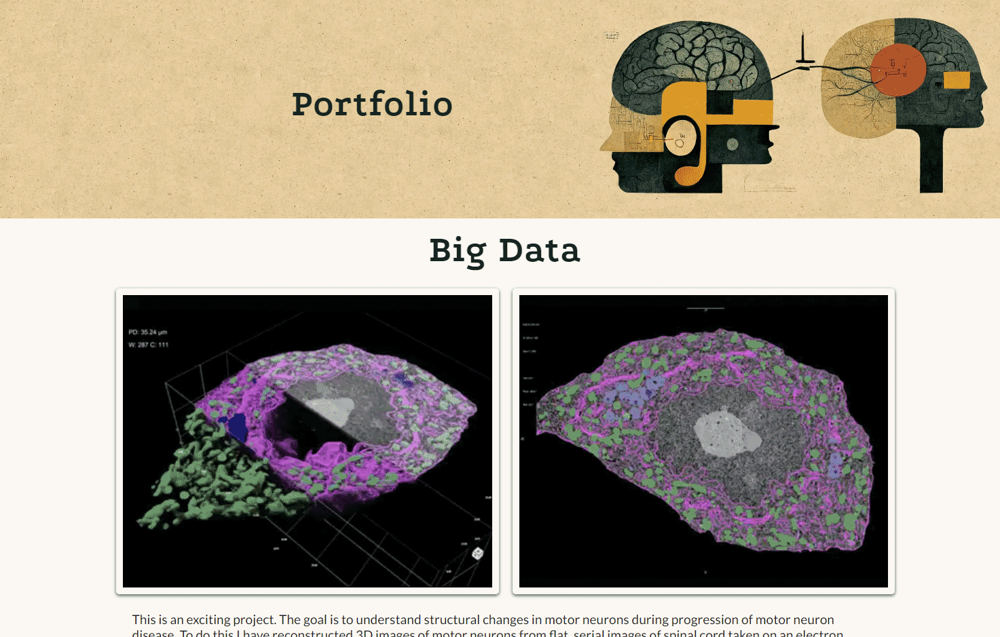
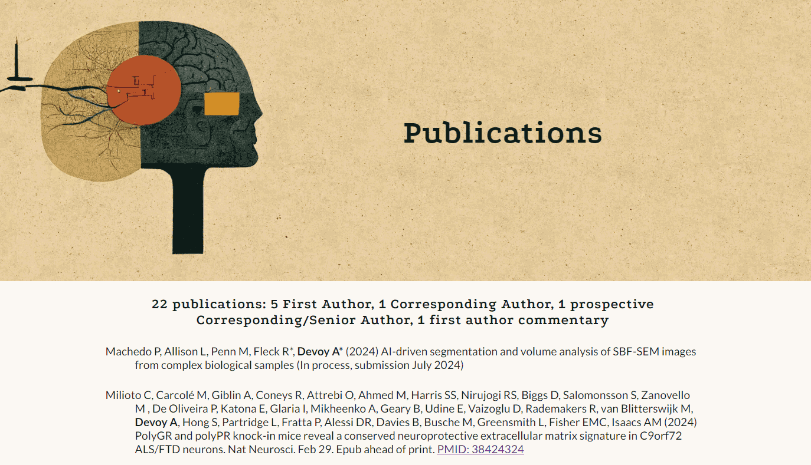

# Portfolio website for Anny Devoy

This portfolio website was developed to showcase the two complementary roles of Anny Devoy, who is a Neuroscientist and Full Stack Developer. Dr Devoy has led and worked on a diverse range of projects. The focus of the website is to highlight this wide range of experience. It communicates the details of each project in a clear and easy to understand way to make the information accessible to those without technical expertise in these areas. The goal of the site is to expand Dr Devoy’s work opportunities by enabling potential employers, recruiters, and collaborators to recognise her unique skillset.

The live portfolio website can be accessed [here](https://annytomica.github.io/portfolio/index.html) 

## Features
### Existing features
#### Hero banner
The hero artwork was created with GenAI (CHatGPT then MidJourney) using the theme of representing the interplay between neuroscience and AI development– the area of tech that Anny is aiming to become part of. 

However, the original image (above) was quite wide and limited the possibilities for overlaying page titles. Therefore, the image was modified in Adobe Photoshop such that each page had a hero image with different elements of the original artwork. This provided a continuity of theme across pages but with increased capacity for functional page titles.

The portfolio and contact pages have different hero images for small and large screens to avoid issues of page title crowding.

#### Logo
The logo was generated using MidJourney, using the initials AD as starting point, with same theme of Neuroscience/AI as for hero image. It was also linked to the hero banner through requested colour palette. The logo shows a stylised line graphic representation of a head and brain while incorporating the initials AD. 

The logo background shape and colour were altered using [Canva](https://www.canva.com/)

A matching favicon was generated from the logo using [Favicon.io](https://favicon.io/favicon-converter/)

#### Navigation bar
The Navbar is featured on all pages of the site and its structure and functionality is based on the navbar from the ‘[love running](https://github.com/Code-Institute-Solutions/love-running-v3/tree/main/3.5b-toggling-a-dropdown-menu)’ walkthrough project.

It has links to all pages – home, portfolio, publications and contact on the right. The logo on the left side of the nav bar is also a link to the homepage. There is an additional hidden easter egg for visitors to find.

The active page is highlighted by colour change to #FDEFD0, with 2pt underline in #C74E24 – colour choices to link to hero and colour palette.

Hovering over the links in the nav bar changes them to #9E9E7B with 2pt underline. 

On screens sizes of tablet and below the page links are a dropdown menu, indicated by using the three stacked bars icon from font awesome.

#### Homepage
The Scientist and Coder titles provide a succinct summary of who Anny Devoy is and immediately piques the interest of the site visitor.

There is a brief introduction paragraph to further introduce Anny and explain what she does and what she is about. This paragraph conndenses to just the first two sentences for small screens.

This is followed by a very simple and clean layout of four thumbnail images for latest projects that link to the relevant sections in the portfolio page. The design has the thumbnails with drop shadow, to attract attention and create the impression they are hovering on the page and highlight they are individual elements.

#### Portfolio
This is the largest page. It showcases all 4 projects. 

Each project has 3-4 images or video that best summarise the project. This is accompanied by one paragraph that provides a clear and succinct description of the project. Care is taken to not assume technical knowledge of the topic so that the information is accessible to everyone.

The Big Data and Neuroscience projects have youtube videos embedded that help summarise the information presented.

The Genome Engineering and Front End projects have a mix of large and small images on large screens. The large images are replaced with small format images on small screens to enable efficient viewing.

#### Publications
This is a very simple page. Its importance is that:
1.	It allows linking the portfolio projects to the relevant publications plus a general overview of Anny Devoy’s research output.
2.	All publications are open access, which means anyone can access and read the papers without being blocked by a paywall. External links to access the full paper are provided for each publication.

On smaller screens the authors list is contracted to just the first four authors, the remainder being replaced by et al. , to limit the screen space each publication takes up and reduce scrolling. The code for this feature was taken from a specific tutorial on [W3.org](https://www.w3.org/WAI/WCAG22/Techniques/css/C7).

#### Contact
The purpose of this page is to allow the visitor to contact Anny Devoy.

The main feature of this page is a contact form, where the user inputs name, email and company as well as the message. 

The contact form takes half the page, with the other half taken up with a dramatic image of a motor neuron imaged by electron microscopy – providing a visual link to other pages. As screen sizes decrease the form stacks on itself and then at mobile screen size the image stacks above the form.

#### Footer
As this site is for professional purposes the focus was put on having professional media links rather than social media, of which Anny Devoy is not a big user.

The links provided are:
- Linked In – professional profile and online CV
- Github – to allow visitors to see Anny Devoy’s code and development processes.
- Research Gate – access to additional data from projects as well as professional Research Scientist profile and impact statistics – funding, citations, science engagement.
- Figma – additional visual projects and visual development processes for portfolio site.

### Features for the future
#### About Me
The About Me page is important to introduce Anny Devoy to the site visitor beyond her professional capacity. It introduces Anny as a real person and humanises the visitor’s perception increasing the likelihood of positive outcomes. This page is not required to fulfil the requirements of Project 1 assessment for the Diploma in Full Stack Development at Code Institute and so, in the interests of keeping the assessed project manageable, was excluded from the original development. Once all assessment has been completed this page will be added and the site deployed to a real domain – annydevoy.com – hosted by Hostinger.

#### Professional Media links on contact page hero banner
On the hero banner the professional media links from the footer will be presented, in larger size than footer, to highlight them as another way to find out more about Anny Devoy’s projects.

#### Features for when the number of portfolio projects increases:
-	Singular pages for each portfolio project – hidden from navbar but linked to via the portfolio page. This would allow reduction of the number of images used on the portfolio page and thus limit the scrolling required on small screens.
-	Make the Scientist and coder on homepage active links to the correct section on the portfolio page.
-	Hide the publications page – While it is important to link to relevant publications from the portfolio page and be available as a general reference, this is a boring looking page. Having it accessible from a different menu in the footer and removing from navbar would be a cleaner approach in the long-term as it is only relevant for the scientist half of the portfolio.

## Site Design Process
### Goal
The goal of the site is to communicate Anny Devoys experience and diverse skillset to a wide audience. The design needs:
1.	to showcase projects from both research science and coding backgrounds.
2.	to clearly communicate each project purpose while avoiding complex ideas and specialist terminology so all projects are accessible to any visitor regardless of background. 
3.	visual appeal to draw visitors in and keep them on the site.
4.	to be clean and easy to navigate with logical internal links. 

### Site Map
The site map was developed in Balsamic. It follows a logical flow across four pages – Home, Portfolio, Publications and Contact.

### Visual Identity
The theme for visual identity was based on the interplay between neuroscience and AI, the two sides of Anny Devoy’s professional experience. The starting point was creating the key hero image with GenAI and building the visual identify from this.
#### Hero
The initial design concept for the hero banner was created using ChatGPT to generate specific prompts that would allow creation of appropriate images in MidJourney. The prompts were then developed further with specific MidJourney cues to add artistic style, size ratio and version use.
#### Colour Palette
The colour palette was generated in Figma, extracting key colours from the Hero image generated in MidJourney. 

#### Logo
The Logo was developed in MidJourney to complement the hero image. The same theme of Neuroscience/AI was used and the hero colour palette was requested. The artistic style was for simplicity, clean lines and flat graphic. While the colour palette was not incorporated with complete accuracy, the design concept was successful. The logo was adapted for use on the site and then also used to create a matching favicon.
#### Design concept - research
Research was done on how other scientists, data scientists and developers created portfolio sites to showcase their work. Elements were taken from many sites. The visual integration of these ideas was then mocked up in Figma to work out which ideas worked best to allow a simple and clean site with easy navigation to be created. The mockup in figma can be accessed [here](assets/readme/readme_figma_mockup.png)
### Wireframe
Once the visual identity was decided, the wireframe structure and functional flow of the site was created in Balsamic. The wireframe for each page can be accessed here - [Home](assets/readme/wireframe_home.png), [portfolio](assets/readme/wireframe_portfolio.png), [publications](assets/readme/wireframe_publications.png), [contact](assets/readme/wireframe_contact.png).
### Development process
The site was constructed with a logical flow – creating each page in empty box format to replicate the wireframe before starting to add content. The navigation bar and footer were completed for all pages, then the basic hero for all pages before focusing on page specific content. The hero design was changed early on, as it became clear the original design concept was not working when incorporating responsive design features. The pages were completed in the following order – home, publications, contact, portfolio. Portfolio was left last as it had the most content and complex structure. Multiple iterations of the portfolio page were developed. Many features from the early design concept did not work well for the information being used and required adaptation. The wireframe was also adapted to reflect these changes.
## Technologies
- HTML – for basic site structure
- CSS – for visual appeal and responsive design features
- GenAI – creation of hero image and logo
    - ChatGPT 3.5 – visual concept creation and prompt development
    - MidJourney – Image generation
- Figma – visual concept development, colour palette selection
- Balsamic – site map and wireframe creation 
- Adobe Photoshop – Adjustment of image sizing and pixel density, modification of hero banner for each page.
- Canva – Midjourney logo modification – background colour adjustment and circular crop
- Pixelied.com – conversion of jpeg and png image files to webp for efficient loading
- Favicon.io – generation of favicon from logo design.
- UI.dev – amiresponsive was used to test each page responsivity to screen size and create site mockup images.

## Testing
### General Strategy
The site was deployed very early on github pages, when just the basic structure of each page plus the nav bar were ready. This allowed daily assessment of functionality of the deployed site and helped identify any issues quickly so they could be fixed before moving on to new features. Gitpod was used as the IDE and the site was run on a server live during development so code could be assessed immediately. Chrome Devtools were actively used during gitpod coding sessions to test responsive features for different screen sizes as they were developed. Changes to code were pushed multiple times a day. Using this strategy most bugs and functionality issues were identified and resolved quickly before they became a major issue for the site.

### Devices and Browsers
#### Web Browsers
Chrome (primary), Firefox , Edge and Brave

#### Devices
- Phones: Pixel4a, iPhoneXR, GalaxyS10
- Tablets: iPad 9.5”, Surface Pro 12” (older model)
- Laptops: Dell Inspirion 13”, MacBook Air 13”, MacBook Pro 17" (older model)
- Desktop screens: BenQ PD series 27”

### Final Validation
HTML – all pages passed validation with no errors detected using the official [W3C HTML validator](https://validator.w3.org/). The summary of results can be found [here](assets/readme/html-validation.png)

CSS – all pages passed validation with no errors detected using the official [W3C CSS validator](https://jigsaw.w3.org/css-validator/). The summary of results can be found [here](assets/readme/css-valdation.png)

Accessibility – all pages showed high accessibility using Chrome [Lighthouse DevTools](https://developer.chrome.com/docs/lighthouse/). The summary of results can be found [here](assets/readme/Lighthouse-validation.png)

## Bugs
### Fixed
-	The red colour (#C74E24) originally usd to highlight active page in nav bar failed accessability contrast checks and so was replaced with an off white colour (#FDEFD0) from the colour palette to fix. The 2px underline was left red so that the visual link to the logo and hero image was maintained.
- The original concept for the contact page had the form overlayed on a background image. The contrast was not acceptable and the background image sizing on different screen sizes was erratic. These issues were resolved by replacing the design concept with one that has the form beside the image.
-	Contact page image loading speeds on was very poor – identified from lighthouse assessment – a new image for with more compression was introduced to overcome this issue, although it can still be improved further for mobile devices.
-	Youtube videos would not work. The tutorial from [W3schools](https://www.w3schools.com/html/html_youtube.asp) helped me identify that the original links used lacked the correct /embed/ action within the link.
- the css aspect-ratio function is unreliable. It sometimes squashes images when the page loads. It is not clear why this happens as the aspect ratio is chosen to match the image dimensions. Object-fit: cover has been used as a solution for the hero-banner image which was most noticably impacted by aspect-ratio. It did not work as a fix for other images - which is why it features in both fixed and unfixed bugs.

### Unfixed

- the css aspect-ratio function is unreliable. It sometimes squashes images when the page loads. It is not clear why this happens as the aspect ratio is chosen to match the image dimensions. Object-fit: cover has been used as a solution for the hero-banner image which was most noticably impacted by aspect-ratio. It did not work as a fix for other images - which is why it features in both fixed and unfixed bugs.
- Not so much a bug, but more a performance issue. The scientific pictures have large amounts of detail and do not compress to small file sizes without significant distortion. This large file size led to slower loading speeds on mobiles. I will need to find a better method of file compression to resolve this issue.
- Again, more preformance issue than bug - the hidden authors on small screens code - taken from w3.org - causes a performance issue flagged up by lighthouse. I will need to find alternative code to create the same feature. 

## Deployment
The site was deployed to GitHub pages using the recommended process.

In Summary:
1.	Within the GitHub repository for this project, the settings tab at the top of the page was accessed.
2.	From settings, the Pages tab was selected from the menu on the left side of the screen (within the Code and Automation section of the menu).
3.	From Pages, the Source was set to ‘Deploy from a Branch’, and the Branch was set to ‘main’.
4.	Once main branch is selected, hit the save button (ignore the folder/(root) menu).
5.	Once saved, the link to the active site will appear at the top of the page.
6.	Alternatively, from the main repository page, within the menu on the right a ‘Deployments’ will now have appeared. This section provides a link to the active site as well as summarizes the number of updates the site has received since initial deployment.

The github repository for this project can be found [here](https://github.com/Annytomica/portfolio/)

## Credits
I would like to acknowledge and thank the following people and resources used in the creation of this site.
### Content
-	[W3schools.com](https://www.w3schools.com/) was used repeatedly for tutorial guidance on responsive design, CSS flex properties, html character entities and insertion of youtube video.
-	[Medium.com](https://medium.com/) was used for guidance on image swapping for small screens and cool features to use in README.md
-	Code for responsive nav bar was taken from the Code Institute Love Running walkthrough project. The code can be found [here](https://github.com/Code-Institute-Solutions/love-running-v3/tree/main/3.5b-toggling-a-dropdown-menu)
-	Code for hiding text on small screens in the midle of paragraphs - used for publications page to hide authors - was taken from W3.org. The code can be found [here](https://www.w3.org/WAI/WCAG22/Techniques/css/C7)
-	The icons in the footer and navbar are from [Font Awesome](https://fontawesome.com/)
-	The form content submission validator was taken from Code Institute course content

### Media
-	The youtube video that explains ALS used on portfolio page was created by [Nature Video](https://www.youtube.com/@NatureVideoChannel)
-	The illustration in the genome engineering project was created by Megan Abel – [iammeganabel.com.](https://iammeganabel.com/) Megan granted permission for use.
-	The Github summary bar used in README.md is from [shields.io](https://shields.io/badges/)
-	All other media used is property of Anny Devoy

### Acknowledgements
Design inspiration was taken from:
- blogs about portfolio site design at [Hostinger](https://www.hostinger.co.uk/tutorials/web-developer-portfolio), [freecodecamp](https://www.freecodecamp.org/news/15-web-developer-portfolios-to-inspire-you-137fb1743cae/) and [careerfoundry](https://careerfoundry.com/en/blog/data-analytics/data-analytics-portfolio-examples/)
- The portfolio sites of [Tim Hopper](https://tdhopper.com/), [Ger Inberg](https://gerinberg.com/) and [Denise Chandler](https://denisechandler.com/)
- [Adham Danaway](https://www.adhamdannaway.com/), whose portfolio website concept was simple, beautiful and many design concepts translated perfectly for the two split roles of Anny Devoy

My mentor, Medale Oluwafemi, for his invaluable guidance and feedback.

My wife, Megan Abel, whose experience as a designer and illustrator helped guide the development of the visual design concept. Statements such as ‘wow, that looks terrible, you need to change that’ and ‘that looks like a site from the early 2000’s’ were particularly helpful.

